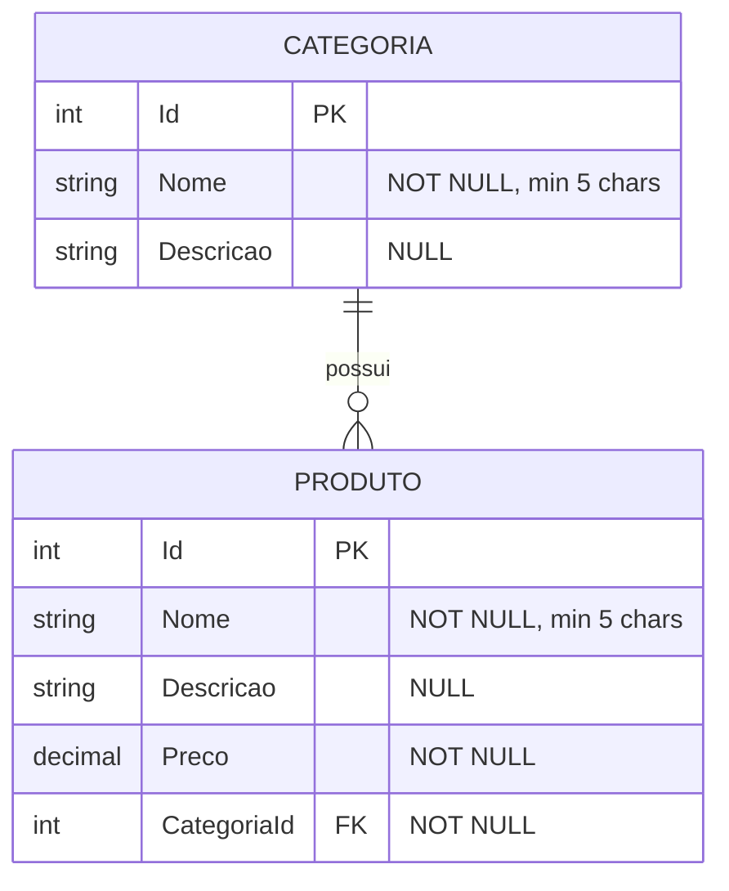

# 03 - Modelo de Dados

## Diagrama Entidade-Relacionamento

## Dicionario de Dados

### Tabela `categorias`

| Coluna | Tipo | Nulo? | Regra |
|---|---|---|---|
| `id` | `serial` (int auto) | NAO | PK |
| `nome` | `varchar(200)` | NAO | Minimo 5 caracteres |
| `descricao` | `varchar(1000)` | SIM | - |

### Tabela `produtos`

| Coluna | Tipo | Nulo? | Regra |
|---|---|---|---|
| `id` | `serial` (int auto) | NAO | PK |
| `nome` | `varchar(200)` | NAO | Minimo 5 caracteres |
| `descricao` | `varchar(1000)` | SIM | - |
| `preco` | `numeric(18,2)` | NAO | >= 0 |
| `categoria_id` | `int` | NAO | FK -> `categorias.id`; ON DELETE RESTRICT |

## Regra de Integridade Referencial

A constraint de FK `produtos.categoria_id -> categorias.id` usa `ON DELETE RESTRICT`. Isso significa que:

- O banco bloqueia tentativas de delete em `categorias` se houver produtos associados.
- A aplicacao tambem valida antes de chamar o `DELETE`, retornando 409 Conflict com mensagem amigavel (AC04).
- A protecao dupla (aplicacao + banco) impede orfaos mesmo em race conditions.

## Convencoes

- Nomes de tabelas e colunas em snake_case (convencao Postgres).
- Mapeamento via Fluent API em `Catalog.Infrastructure/Persistence/Configurations/`.
- Migrations versionadas em `Catalog.Infrastructure/Persistence/Migrations/` (geradas por `dotnet ef`).
